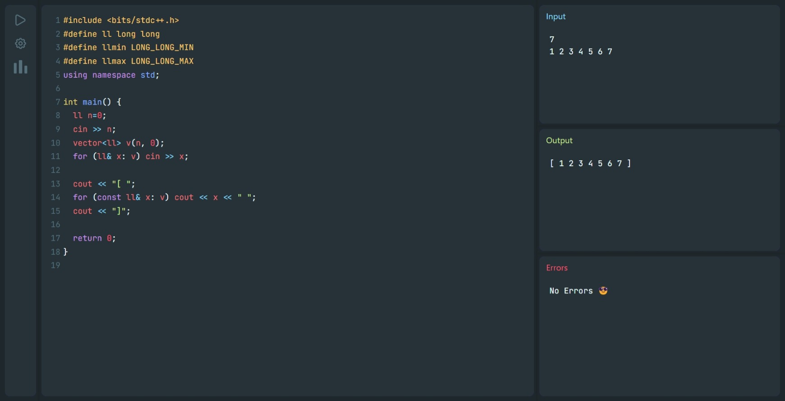
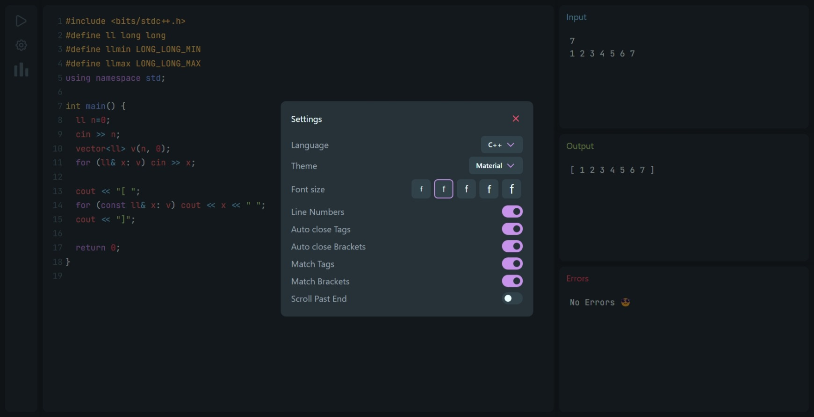

# online-compiler
<h1 align="center">
    
    <a href="https://github.com/vignasri-jadala/online-compiler">
        <span valign="middle">
                Code & Run
        </span>
    </a>
</h1>

<p align="center">
    <a href="https://github.com/vignasri-jadala/online-compiler/commits/master">
    
    </a>
    <a href="https://github.com/vignasri-jadala/online-compiler/issues">
    
    </a>
    <a href="https://github.com/vignasri-jadala/online-compiler/pulls">
    
    </a>
</p>

### Made with: [NextJS](https://nextjs.org/), [Tailwind CSS](https://tailwindcss.com/), [Framer Motion](https://www.framer.com/motion/)
### 🚀 Live App: https://online-compiler.vercel.app
#### Don't know why I chose NextJS over React :sweat_smile: Actually I started this project while trying out NextJS. So, I continued it :smile:

### Home


### Settings


#### TODO
- [x] Interactive UI Animations
    - [x] Sidebar Icons
    - [x] Modals
    - [x] Output, Error consoles
- [x] Global Theme
    - [x] ThemeBoiiContext
    - [x] Themes
- [ ] User Authentication

#### To run on local server
```bash
git clone https://github.com/vignasri-jadala/online-compiler.git
cd online-compiler
npm install
npm run dev
```
